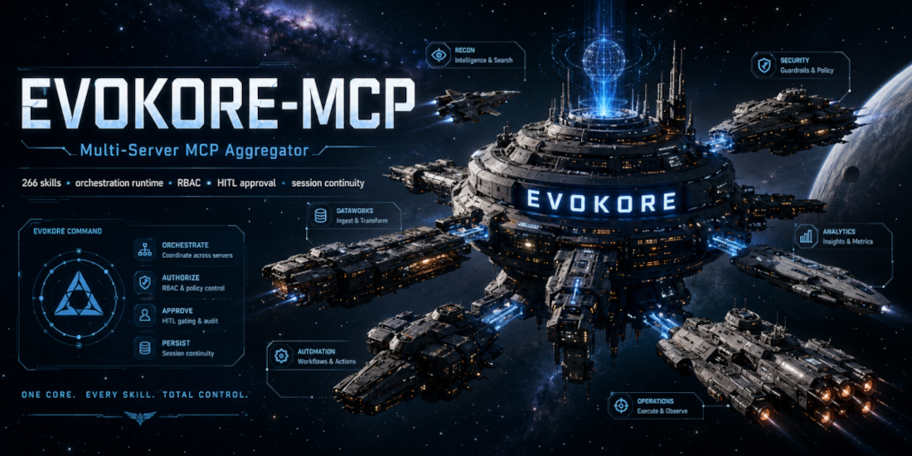

<p align="center">
  
</p>

# EVOKORE-MCP

> Multi-server MCP aggregator with 266 skills, an orchestration runtime, fleet/claims coordination, and hook-driven session governance for autonomous Claude/Cursor/Gemini agent runs.

[](LICENSE)
[](package.json)
[](https://modelcontextprotocol.io)
[](CHANGELOG.md)
[](#testing)

EVOKORE-MCP is a TypeScript stdio/HTTP MCP router and multi-server aggregator. It gives an AI client a single MCP endpoint that combines EVOKORE's native workflow tools with proxied child servers defined in `mcp.config.json`, while adding namespace isolation, dynamic tool discovery, RBAC, rate limiting, human-in-the-loop approval controls, and persistent session continuity.

It is built for operators who run their own AI agents — locally, autonomously, on their own machine — and want a single configurable proxy in front of every other MCP server they use.

## Table of contents

- [Quick start](#quick-start)
- [Security posture: `dangerouslySkipPermissions: true`](#security-posture-dangerouslyskippermissions-true)
- [Current capabilities](#current-capabilities)
- [System overview](#system-overview)
- [Native tool surface](#native-tool-surface)
- [Operator paths](#operator-paths)
- [Contributor and maintainer paths](#contributor-and-maintainer-paths)
- [Runtime modules](#runtime-modules)
- [Testing](#testing)
- [Latest release](#latest-release)
- [Contributing](#contributing)
- [Project governance](#project-governance)
- [Contributors](#contributors)
- [Star history](#star-history)
- [License](#license)

## Quick start

```bash
# 1. Clone, install, build
git clone https://github.com/mattmre/EVOKORE-MCP-PUBLIC.git
cd EVOKORE-MCP-PUBLIC
npm ci
npm run build

# 2. Configure your environment
cp .env.example .env
# edit .env to add child-server credentials (optional)

# 3. Register EVOKORE with your MCP client
npm run sync:dry    # preview
npm run sync        # apply to Claude Code, Claude Desktop, Cursor, Copilot CLI, Codex CLI
```

Or register manually by pointing your client at `dist/index.js`:

```json
{
  "mcpServers": {
    "evokore-mcp": {
      "command": "node",
      "args": ["/absolute/path/to/EVOKORE-MCP-PUBLIC/dist/index.js"]
    }
  }
}
```

Full setup including environment variables, child-server credentials, and per-client registration: [docs/SETUP.md](docs/SETUP.md).

## Security posture: `dangerouslySkipPermissions: true`

EVOKORE-MCP ships with `"dangerouslySkipPermissions": true` in [.claude/settings.json](.claude/settings.json). This is **intentional and deliberate.** Third-party security scanners will flag it; this section exists so the choice is explicit and defensible.

### What this setting does

`dangerouslySkipPermissions` is a Claude Code setting that disables the built-in per-tool-call permission prompt. With it on, Claude does not stop to ask "allow this Bash command?" or "allow this file write?" between tool invocations. With it off, every tool call requires an interactive y/n.

### Why EVOKORE ships it on

EVOKORE is an orchestration framework. Its native surface includes a fleet manager, panel-of-experts skill, multi-agent claims coordination, an orchestration runtime, and 266 skills that compose into long autonomous chains. A permission prompt between every Bash and Edit would interrupt those chains every few seconds and make the framework unusable for its intended workflows.

We compensate by moving the safety net **out of the synchronous Claude Code permission prompt** and **into a hook-driven, repo-scoped policy layer** that runs on every tool call:

| Compensating control | Where |
|---|---|
| Damage Control hook (49 rules: force pushes, history rewrites, working-tree wipes, fork bombs, reverse shells, encoded payloads, exfiltration, repo guardrails — many `ask: true`, some hard-block) | [damage-control-rules.yaml](damage-control-rules.yaml), [scripts/hooks/damage-control.js](scripts/hooks/damage-control.js) |
| Purpose-gate hook (first-prompt intent capture + ongoing reminder injection) | [scripts/hooks/purpose-gate.js](scripts/hooks/purpose-gate.js) |
| Session replay (every tool call logged to JSONL for forensic review) | [scripts/hooks/session-replay.js](scripts/hooks/session-replay.js) |
| Evidence capture (test results, file changes, git ops captured as numbered evidence rows) | [scripts/hooks/evidence-capture.js](scripts/hooks/evidence-capture.js) |
| RBAC permissions (`admin` / `developer` / `readonly`) for proxied tools | [permissions.yml](permissions.yml), `EVOKORE_ROLE` env var |
| OAuth bearer-token auth for HTTP transport | [docs/OAUTH_SETUP.md](docs/OAUTH_SETUP.md) |
| Multi-tenant session isolation for HTTP transport | [docs/HTTP_DEPLOYMENT.md](docs/HTTP_DEPLOYMENT.md) |
| HITL approval flow (`_evokore_approval_token`) for tools tagged `require_approval` | [permissions.yml](permissions.yml), [docs/USAGE.md](docs/USAGE.md) |

The net effect: EVOKORE swaps the interactive Claude Code prompt for a programmatic, declarative, auditable, repo-versioned policy that catches the same destructive operations *and* leaves a replay trail.

### Threat model

**This setting is for:** developers running EVOKORE-MCP on their own machine, against their own filesystem and git repos, with their own API credentials, in a single-tenant workstation context.

**This setting is NOT for:** anyone exposing the MCP server to the public internet, multi-tenant environments without further hardening, or contexts where the operator cannot trust the agent prompts. If you are deploying EVOKORE over HTTP transport to remote clients, enable OAuth (see [docs/OAUTH_SETUP.md](docs/OAUTH_SETUP.md)), use the multi-tenant session isolation surface, and consider running the damage-control ruleset with the operator opt-in environment flags un-set.

### How to opt out

If you would rather have Claude Code's native per-tool-call permission prompts back, edit [.claude/settings.json](.claude/settings.json):

```json
{
  "dangerouslySkipPermissions": false
}
```

Then restart your Claude Code session. The damage-control hook, replay, evidence-capture, and purpose-gate continue to run regardless of this setting — they are independent layers.

## Current capabilities

- **Single MCP endpoint** for native EVOKORE tools plus proxied child servers (stdio default; HTTP transport via [docs/HTTP_DEPLOYMENT.md](docs/HTTP_DEPLOYMENT.md)).
- **37 native tools** across 10 managers — see [Native tool surface](#native-tool-surface).
- **Proxied server aggregation** from `mcp.config.json` (default: `github`, `fs`; optional: `elevenlabs`, `supabase`, `stitch`, and local reverse-engineering integrations).
- **Tool prefixing** in the form `${serverId}_${tool.name}` to avoid namespace collisions.
- **Tool discovery modes**: `legacy` (default — full native + proxied listing) and `dynamic` (always-visible native + session-activated proxied).
- **Discovery profiles** with measured token budgets: `coding`, `research`, `voice`, `legacy-full`, `legacy-dynamic` — see [docs/TOOL_DISCOVERY_PROFILES.md](docs/TOOL_DISCOVERY_PROFILES.md).
- **HITL approval flow** via `_evokore_approval_token`: one-time, exact-args, short-lived retries for tagged tools.
- **RBAC permissions** with `admin` / `developer` / `readonly` roles via `EVOKORE_ROLE`; backwards-compatible with flat permissions.
- **Rate limiting** with configurable per-server and per-tool token buckets via `rateLimit` in `mcp.config.json`.
- **MCP resources + prompts** (`resources/list` returns skill URIs and server-level resources; `prompts/list` returns `resolve-workflow`, `skill-help`, `server-overview`).
- **Tool annotations** (`readOnlyHint`, `destructiveHint`, `idempotentHint`, `openWorldHint`, `title`) on every native tool.
- **Skill ecosystem**: 266 versioned skills with dependency resolution, remote registries, and sandboxed execution.
- **Session dashboard** at `127.0.0.1:8899` via `npm run dashboard`, with HITL approval UI at `/approvals`.
- **Async proxy boot**: child servers boot in the background so the MCP handshake completes immediately.
- **Hook-driven safety + observability** (damage-control, purpose-gate, session-replay, evidence-capture, tilldone, voice-stop) — see [Security posture](#security-posture-dangerouslyskippermissions-true).
- **Operator continuity tooling**: session manifests, Claude memory sync, manifest-backed status summaries, `npm run repo:audit`.
- **Voice integrations**: proxied ElevenLabs tools, VoiceMode guidance, standalone VoiceSidecar on `ws://localhost:8888`.
- **Plugin system**: hot-reloadable plugins via `plugins/` directory, with webhook event hooks.
- **Webhook events**: HMAC-SHA256 signed events for tool calls, errors, sessions, approvals, plugin lifecycle.

## System overview


## Native tool surface

37 native tools across 10 managers (proxied tools are dynamic and not counted here):

- **SkillManager (12):** `docs_architect`, `skill_creator`, `resolve_workflow`, `search_skills`, `get_skill_help`, `discover_tools`, `proxy_server_status`, `refresh_skills`, `fetch_skill`, `list_registry`, `execute_skill`, `describe_tool`
- **ClaimsManager (4):** `claim_acquire`, `claim_release`, `claim_list`, `claim_sweep`
- **FleetManager (4):** `fleet_spawn`, `fleet_claim`, `fleet_release`, `fleet_status`
- **MemoryManager (3):** `memory_store`, `memory_search`, `memory_list`
- **OrchestrationRuntime (3):** `orchestration_start`, `orchestration_stop`, `orchestration_status`
- **SessionAnalyticsManager (4):** `session_context_health`, `session_analyze_replay`, `session_work_ratio`, `session_trust_report`
- **TelemetryManager (2):** `get_telemetry`, `reset_telemetry`
- **WorkerManager (2):** `worker_dispatch`, `worker_context`
- **NavigationAnchorManager (2):** `nav_get_map`, `nav_read_anchor`
- **PluginManager (1):** `reload_plugins`

## Operator paths

- **First-time setup**: [docs/SETUP.md](docs/SETUP.md)
- **Day-to-day usage**: [docs/USAGE.md](docs/USAGE.md)
- **Practical walkthroughs**: [docs/USE_CASES_AND_WALKTHROUGHS.md](docs/USE_CASES_AND_WALKTHROUGHS.md)
- **Tool discovery behavior**: [docs/TOOLS_AND_DISCOVERY.md](docs/TOOLS_AND_DISCOVERY.md)
- **Voice and hooks**: [docs/VOICE_AND_HOOKS.md](docs/VOICE_AND_HOOKS.md)
- **Troubleshooting**: [docs/TROUBLESHOOTING.md](docs/TROUBLESHOOTING.md)
- **Self-contained presentations**: open [presentations/index.html](presentations/index.html) directly in a browser for the executive summary, technical analysis, Panel of Experts walkthrough, ARCH-AEP walkthrough, skill spotlights, and workflow flowcharts.
- **Local lookup wiki**: run `npm run wiki:build`, then open [wiki/index.html](wiki/index.html) for a static search-and-browse view of all 266 skills, 37 native tools, and documented env vars.

## Contributor and maintainer paths

- **Documentation portal**: [docs/README.md](docs/README.md)
- **Runtime architecture**: [docs/ARCHITECTURE.md](docs/ARCHITECTURE.md)
- **Validation surface**: [docs/TESTING_AND_VALIDATION.md](docs/TESTING_AND_VALIDATION.md)
- **HTTP deployment**: [docs/HTTP_DEPLOYMENT.md](docs/HTTP_DEPLOYMENT.md)
- **OAuth setup**: [docs/OAUTH_SETUP.md](docs/OAUTH_SETUP.md)
- **Plugin authoring**: [docs/PLUGIN_AUTHORING.md](docs/PLUGIN_AUTHORING.md)
- **Webhook envelope**: [docs/WEBHOOK_ENVELOPE_V1.md](docs/WEBHOOK_ENVELOPE_V1.md) / [docs/WEBHOOK_GUIDE.md](docs/WEBHOOK_GUIDE.md)

## Runtime modules

| Module | Role |
|---|---|
| `src/index.ts` | Main MCP server, request handlers, discovery-mode projection, MCP resources/prompts, session activation state |
| `src/SkillManager.ts` | Skill-management tools (12 of 37 native), skill indexing, versioning, remote fetch, sandboxed execution |
| `src/ProxyManager.ts` | Child-server boot (stdio + HTTP), prefixing, proxy execution, rate limiting, cooldown, env interpolation, async boot |
| `src/ToolCatalogIndex.ts` | Unified native + proxied tool catalog, search index, projected tool listing |
| `src/SecurityManager.ts` | HITL/allow/deny policy with RBAC role support (`admin`, `developer`, `readonly`) |
| `src/HttpServer.ts` | StreamableHTTP server transport with OAuth, session isolation, per-session rate limiting |
| `src/WebhookManager.ts` | HMAC-SHA256 signed webhook events with fire-and-forget delivery |
| `src/PluginManager.ts` | External plugin loader with hot-reload via `reload_plugins` |
| `src/VoiceSidecar.ts` | Standalone WebSocket voice runtime for hook-driven speech |
| `permissions.yml` | Flat and role-based permission rules for proxied tools |
| `mcp.config.json` | Child-server registry and rate-limit configuration |
| `scripts/` | Config sync, hooks, replay viewers, session dashboard, benchmark tooling, governance helpers |

## Testing

```bash
npm test                  # full vitest suite (102 test files)
npm run build             # tsc build
npm run repo:audit        # operator preflight (branch drift, worktree pressure, stale branches, control-plane drift)
```

No public CI runner is currently configured on the public mirror. Tests are run locally before each tagged release.

## Latest release

**v3.1.0** — see [CHANGELOG.md](CHANGELOG.md) for the entry. Highlights: TTS provider abstraction, file-backed session persistence, cross-CLI config sync, and tool-discovery tiering (named profiles, cursor pagination, schema-deferred bootstrap). Release notes will appear at [GitHub Releases](https://github.com/mattmre/EVOKORE-MCP-PUBLIC/releases) once the tag is published.

## Contributing

This repository uses a PR-first workflow for meaningful changes. See [CONTRIBUTING.md](CONTRIBUTING.md) and [CODE_OF_CONDUCT.md](CODE_OF_CONDUCT.md) before opening a PR.

Short version:

1. Branch from `main`.
2. Keep docs and code aligned when you change runtime behavior.
3. For process/tooling/release-impacting changes, follow [.github/PULL_REQUEST_TEMPLATE.md](.github/PULL_REQUEST_TEMPLATE.md).

## Project governance

- **License**: [MIT](LICENSE)
- **Code of conduct**: [CODE_OF_CONDUCT.md](CODE_OF_CONDUCT.md)
- **Security policy / reporting**: [SECURITY.md](SECURITY.md)
- **Support channels**: [SUPPORT.md](SUPPORT.md)
- **Citation**: [CITATION.cff](CITATION.cff)
- **Third-party attributions**: [NOTICE](NOTICE) (and [THIRD_PARTY_LICENSES.md](THIRD_PARTY_LICENSES.md) when published)

## Contributors

<a href="https://github.com/mattmre/EVOKORE-MCP-PUBLIC/graphs/contributors">
  
</a>

## Star history

[](https://star-history.com/#mattmre/EVOKORE-MCP-PUBLIC&Date)

## License

EVOKORE-MCP is released under the [MIT License](LICENSE). Third-party skill packs vendored under `SKILLS/` retain their original upstream licenses — see [NOTICE](NOTICE) for the per-upstream attribution table.
