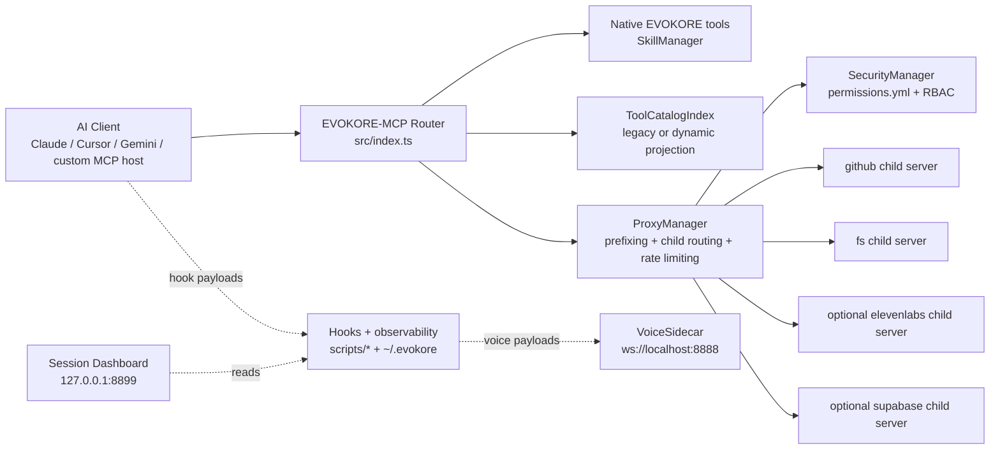

# EVOKORE-MCP

EVOKORE-MCP is a TypeScript-based stdio MCP router and multi-server aggregator. It gives AI clients a single MCP endpoint that combines EVOKORE’s native workflow tools with proxied child servers defined in `mcp.config.json`, while adding namespace isolation, dynamic tool discovery, and human-in-the-loop approval controls.

Current package/runtime version: `3.1.0`.

## Current operator snapshot

- **Runtime shape:** stdio MCP router plus multi-server child aggregation
- **Native tool surface (37 tools across 10 managers):**
  - **SkillManager (12):** `docs_architect`, `skill_creator`, `resolve_workflow`, `search_skills`, `get_skill_help`, `discover_tools`, `proxy_server_status`, `refresh_skills`, `fetch_skill`, `list_registry`, `execute_skill`, `describe_tool`
  - **ClaimsManager (4):** `claim_acquire`, `claim_release`, `claim_list`, `claim_sweep`
  - **FleetManager (4):** `fleet_spawn`, `fleet_claim`, `fleet_release`, `fleet_status`
  - **MemoryManager (3):** `memory_store`, `memory_search`, `memory_list`
  - **OrchestrationRuntime (3):** `orchestration_start`, `orchestration_stop`, `orchestration_status`
  - **SessionAnalyticsManager (4):** `session_context_health`, `session_analyze_replay`, `session_work_ratio`, `session_trust_report`
  - **TelemetryManager (2):** `get_telemetry`, `reset_telemetry`
  - **WorkerManager (2):** `worker_dispatch`, `worker_context`
  - **NavigationAnchorManager (2):** `nav_get_map`, `nav_read_anchor`
  - **PluginManager (1):** `reload_plugins`
- **v3.1 capabilities:** v3.0 RBAC + rate limiting + HTTP transport + MCP resources/prompts + tool annotations + skill ecosystem (versioning, registry, sandbox) + session dashboard + async proxy boot, expanded with the orchestration runtime, fleet/claims coordination, persistent memory, session analytics, telemetry, worker dispatch, navigation anchors, and plugin manifest hot-reload
- **Continuity surfaces:** canonical session manifest, managed Claude memory sync, manifest-backed status line, repo-state audit CLI
- **Voice surfaces:** proxied ElevenLabs tools, VoiceMode guidance, standalone VoiceSidecar with persona-aware hook forwarding
- **Recent change report:** [docs/RECENT_ADDITIONS_2026-03-12.md](docs/RECENT_ADDITIONS_2026-03-12.md)

## Why EVOKORE exists

EVOKORE exists to solve three common MCP operator problems:

- **Too many disconnected MCP endpoints**: EVOKORE collapses multiple child servers into one stdio server.
- **Too much tool-context overhead**: EVOKORE can run in `legacy` mode for broad compatibility or `dynamic` mode for session-scoped tool activation.
- **Too little operational control**: EVOKORE adds HITL approval, duplicate-prefix collision handling, runtime guardrails, and continuity docs for long-running repo work.

## Current capabilities

- **Single stdio MCP endpoint** for native EVOKORE tools plus proxied child servers.
- **37 native tools** registered across 10 managers — see the [Native tool surface](#current-operator-snapshot) above for the per-manager breakdown.
- **Proxied server aggregation** from `mcp.config.json`, currently `github` and `fs`, plus opt-in local reverse-engineering child servers for `ghidra_headless`, `reva`, and `binary_analysis`. The `elevenlabs`, `supabase`, and `stitch` integrations are disabled by default and require their respective API keys before they can be enabled.
- **Prefixed proxied tools** in the form `${serverId}_${tool.name}` to avoid collisions.
- **Tool discovery modes**:
  - `legacy` (default): full native + proxied tool listing
  - `dynamic`: always-visible native tools plus session-activated proxied tools
- **Exact-name compatibility in dynamic mode**: hidden proxied tools still remain callable by exact prefixed name.
- **HITL approval flow** using `_evokore_approval_token`, with one-time, exact-args, short-lived retries.
- **RBAC permissions** with `admin`, `developer`, and `readonly` roles via `EVOKORE_ROLE` env var. Backwards-compatible with flat permissions when unset.
- **Rate limiting** with configurable per-server and per-tool token bucket rate limits via `rateLimit` in `mcp.config.json`.
- **HTTP transport** for child servers via `StreamableHTTPClientTransport`. Configure with `"transport": "http"` and `"url"` in `mcp.config.json`.
- **MCP resources and prompts**: `resources/list` returns skill URIs and server-level resources; `prompts/list` returns `resolve-workflow`, `skill-help`, and `server-overview`.
- **Tool annotations**: all native tools carry MCP annotations (`readOnlyHint`, `destructiveHint`, `idempotentHint`, `openWorldHint`) and `title` fields.
- **Skill ecosystem**: versioned skills with dependency resolution, remote skill registries, and sandboxed skill execution.
- **Session dashboard** at `127.0.0.1:8899` via `npm run dashboard`, with HITL approval UI at `/approvals`.
- **Async proxy boot**: child servers boot in the background so the MCP handshake completes immediately.
- **Operator continuity tooling** through session manifests, Claude memory sync, manifest-backed status summaries, and `npm run repo:audit`.
- **Voice integrations** across proxied ElevenLabs tools, VoiceMode guidance, and the standalone VoiceSidecar.
- **Ops and governance hardening** for docs integrity, release flow, PR metadata, submodule cleanliness, tracker consistency, and Windows runtime behavior.

## System overview



## Quick start

### 1. Install and build

```bash
npm ci
npm run build
```

### 2. Configure environment

Copy `.env.example` to `.env` and set the values you need:

```bash
GITHUB_PERSONAL_ACCESS_TOKEN=your_token_here
ELEVENLABS_API_KEY=your_key_here
SUPABASE_ACCESS_TOKEN=your_token_here

# Optional
EVOKORE_TOOL_DISCOVERY_MODE=legacy
EVOKORE_ROLE=developer
EVOKORE_SKILL_WATCHER=true
EVOKORE_CHILD_SERVER_BOOT_TIMEOUT_MS=30000
```

### 3. Register EVOKORE with your MCP client

Point your client at the compiled runtime entrypoint:

```json
{
  "mcpServers": {
    "evokore-mcp": {
      "command": "node",
      "args": ["/absolute/path/to/EVOKORE-MCP/dist/index.js"]
    }
  }
}
```

You can also use the sync helper for supported CLIs:

```bash
npm run sync:dry
npm run sync
```

This currently automates `Claude Code`, `Claude Desktop`, `Cursor`, `Copilot CLI`, and `Codex CLI`. `Gemini CLI` remains a manual command surfaced by the sync helper.

### 4. Start using the router

- In **legacy mode**, your client sees the full native + proxied tool list.
- In **dynamic mode**, use `discover_tools` to activate relevant proxied tools for the current session.
- For protected proxied tools, EVOKORE returns an `_evokore_approval_token` and requires explicit human approval before retry.

### 5. If you are resuming repo work, run the operator preflight

```bash
npm run repo:audit
```

Use this before a new multi-slice session or cleanup wave to surface branch divergence, worktree pressure, stale branch candidates, open PR heads, and control-plane drift.

## Operator paths

- **First-time setup**: [docs/SETUP.md](docs/SETUP.md)
- **Day-to-day usage**: [docs/USAGE.md](docs/USAGE.md)
- **Practical walkthroughs**: [docs/USE_CASES_AND_WALKTHROUGHS.md](docs/USE_CASES_AND_WALKTHROUGHS.md)
- **Tool discovery behavior**: [docs/TOOLS_AND_DISCOVERY.md](docs/TOOLS_AND_DISCOVERY.md)
- **Voice and hooks**: [docs/VOICE_AND_HOOKS.md](docs/VOICE_AND_HOOKS.md)
- **Troubleshooting**: [docs/TROUBLESHOOTING.md](docs/TROUBLESHOOTING.md)
- **Self-contained presentations**: open [presentations/index.html](presentations/index.html) directly in a browser for the executive summary, technical analysis, Panel of Experts walkthrough, ARCH-AEP walkthrough, skill spotlights, and workflow flowcharts.
- **Local lookup wiki**: run `npm run wiki:build`, then open [wiki/index.html](wiki/index.html) for a static search-and-browse view of all 266 skills, 37 native tools, and documented env vars.
- **Last two weeks report**: [docs/RECENT_ADDITIONS_2026-03-12.md](docs/RECENT_ADDITIONS_2026-03-12.md)

## Contributor and maintainer paths

- **Documentation portal**: [docs/README.md](docs/README.md)
- **Runtime architecture**: [docs/ARCHITECTURE.md](docs/ARCHITECTURE.md)
- **Validation surface**: [docs/TESTING_AND_VALIDATION.md](docs/TESTING_AND_VALIDATION.md)
- **Research and handoffs**: [docs/RESEARCH_AND_HANDOFFS.md](docs/RESEARCH_AND_HANDOFFS.md)
- **Recent additions report**: [docs/RECENT_ADDITIONS_2026-03-12.md](docs/RECENT_ADDITIONS_2026-03-12.md)
- **PR merge governance**: [docs/PR_MERGE_RUNBOOK.md](docs/PR_MERGE_RUNBOOK.md)
- **Submodule workflow**: [docs/SUBMODULE_WORKFLOW.md](docs/SUBMODULE_WORKFLOW.md)

## Runtime module summary

| Module | Role |
|---|---|
| `src/index.ts` | Main stdio MCP server, request handlers, discovery-mode projection, MCP resources/prompts, session activation state |
| `src/SkillManager.ts` | Skill-management tools (12 of 37 native), skill indexing, versioning, remote fetch, and sandboxed execution |
| `src/ProxyManager.ts` | Child-server boot (stdio + HTTP), prefixing, proxy execution, rate limiting, cooldown, env interpolation, async boot |
| `src/ToolCatalogIndex.ts` | Unified native + proxied tool catalog, search index, projected tool listing |
| `src/SecurityManager.ts` | HITL/allow/deny policy with RBAC role support (`admin`, `developer`, `readonly`) |
| `permissions.yml` | Flat and role-based permission rules for proxied tools |
| `mcp.config.json` | Child-server registry for hosted integrations plus opt-in reverse-engineering child servers; rate limit config |
| `src/VoiceSidecar.ts` | Standalone WebSocket voice runtime for hook-driven speech |
| `scripts/` | Config sync, hook observability, replay viewers, session dashboard, benchmark tooling, and governance helpers |

## Recent implementation and research highlights

- **v3.1.0 shipped** with the orchestration runtime, fleet/claims coordination, persistent memory, session analytics, telemetry, worker dispatch, navigation anchors, and plugin manifest hot-reload, on top of v3.0's RBAC, rate limiting, HTTP transport, MCP resources/prompts, tool annotations, skill versioning, remote registries, sandboxed execution, session dashboard, and async proxy boot.
- **37 native tools** across 10 managers, with the SkillManager surface (`refresh_skills`, `fetch_skill`, `execute_skill`, `list_registry`, `describe_tool`, etc.) anchoring the skill ecosystem and the orchestration/fleet/claims/memory surfaces anchoring multi-agent coordination.
- **Supabase integration** added as a proxied child server with tiered permissions (10 allow, 4 require_approval, 3 deny).
- **Session dashboard** at `127.0.0.1:8899` with HITL approval UI at `/approvals`.
- **Dynamic tool discovery MVP landed** with `legacy` default mode, opt-in `dynamic` mode, session-scoped activation, and exact-name compatibility for hidden proxied tools.
- **Recursive skill indexing and semantic workflow resolution landed** with metadata-aware search, performance monitoring, and actionable reranking in `resolve_workflow`.
- **Session continuity, Claude memory sync, manifest-backed status line, and repo-state audit landed** so repo work can restart safely with less context drift.
- **VoiceSidecar matured into a standalone runtime** on `ws://localhost:8888`, with `voices.json` hot-reload per new connection, playback disable support, and audio artifact saving.
- **Windows runtime behavior is now explicit**: EVOKORE remaps only `npx` to `npx.cmd`; `uv` and `uvx` must resolve directly on PATH.
- **Governance and continuity docs are first-class** through PR metadata validation, tracker consistency checks, docs link validation, release gating, and research/session logs.

## Detailed documentation

- [docs/README.md](docs/README.md) — canonical docs portal
- [docs/SETUP.md](docs/SETUP.md) — install, env, client registration, and first-run validation
- [docs/ARCHITECTURE.md](docs/ARCHITECTURE.md) — runtime architecture, modules, routing, and tech stack
- [docs/TOOLS_AND_DISCOVERY.md](docs/TOOLS_AND_DISCOVERY.md) — native vs proxied tools, discovery lifecycle, and tradeoffs
- [docs/VOICE_AND_HOOKS.md](docs/VOICE_AND_HOOKS.md) — voice systems, hook pipeline, observability, and state locations
- [docs/TESTING_AND_VALIDATION.md](docs/TESTING_AND_VALIDATION.md) — subsystem validations, CI, release, Windows, and docs checks
- [docs/RESEARCH_AND_HANDOFFS.md](docs/RESEARCH_AND_HANDOFFS.md) — tracker, logs, continuity docs, and handoff conventions
- [docs/TRAINING_AND_USE_CASES.md](docs/TRAINING_AND_USE_CASES.md) — broader training material

## Validation references

- Full regression: `npm test` (vitest, 73 files, 180+ tests)
- Build: `npm run build`
- Repo audit: `npm run repo:audit`

## Contributing

This repository uses a PR-first workflow for meaningful changes.

1. Branch from `main`.
2. Keep docs and code aligned when you change runtime behavior.
3. For process/tooling/release-impacting changes, use `.github/PULL_REQUEST_TEMPLATE.md` and follow [docs/PR_MERGE_RUNBOOK.md](docs/PR_MERGE_RUNBOOK.md).
4. Re-check [docs/README.md](docs/README.md) before landing cross-cutting changes.
