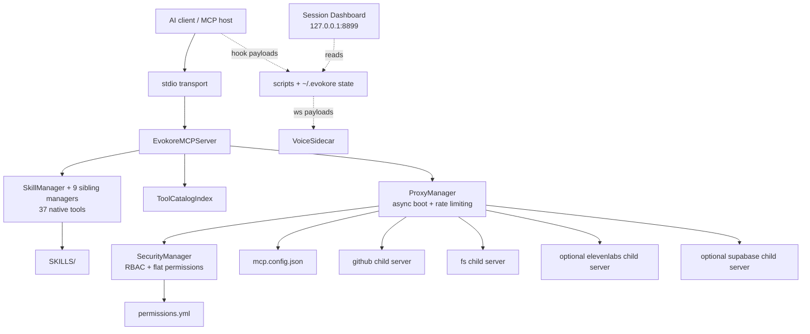
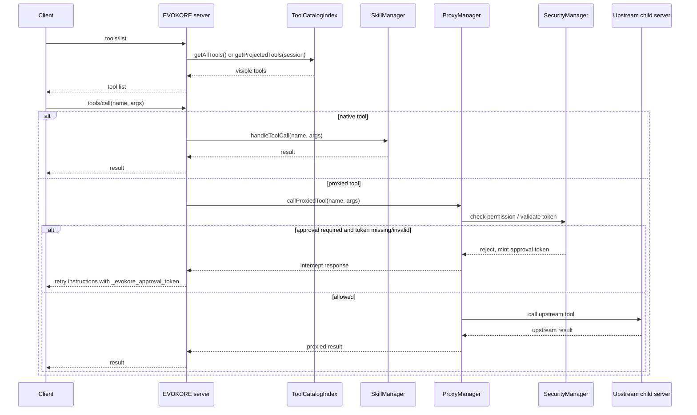

# EVOKORE Runtime Architecture

EVOKORE-MCP is a stdio MCP server that merges a fixed surface of EVOKORE-native tools with a configurable set of proxied child MCP servers, then projects that combined tool surface in either `legacy` or `dynamic` discovery mode, with RBAC permissions, rate limiting, async proxy boot, and an out-of-band voice sidecar. This page describes the current runtime shape, the module breakdown, the request flow, and the persistent state EVOKORE writes.

## What this covers

- Runtime layers, tech stack, and tool populations
- Discovery modes and the startup lifecycle
- Per-module responsibilities and request routing
- Runtime state on disk
- RBAC, rate limiting, dashboard, resources, prompts, and tool annotations

## Runtime layers

| Layer | Current implementation | Responsibility |
|---|---|---|
| MCP server | `src/index.ts` | Owns stdio transport, MCP request handlers, MCP resources/prompts, discovery mode, tool annotations, and session-scoped tool activation |
| Native tool layer | `src/SkillManager.ts` and nine sibling managers | Provide 37 EVOKORE-native tools across ten managers, plus skill retrieval, versioning, remote fetch, and sandboxed execution |
| Proxy layer | `src/ProxyManager.ts` | Boots child servers (stdio + HTTP) from `mcp.config.json`, prefixes tools, forwards calls, manages rate limiting, cooldown/error state, and async boot |
| Security layer | `src/SecurityManager.ts` + `permissions.yml` | Applies `allow`, `require_approval`, and `deny` policy with RBAC role support before proxied execution |
| Catalog/search layer | `src/ToolCatalogIndex.ts` | Merges native + proxied tools, indexes them, and builds projected tool lists |
| Continuity/operator layer | `scripts/session-continuity.js`, `scripts/status-runtime.js`, `scripts/claude-memory.js`, `scripts/repo-state-audit.js` | Keeps repo work restartable through session manifests, managed memory, status summaries, and repo-state preflight auditing |
| Voice side runtime | `src/VoiceSidecar.ts` | Separate standalone WebSocket voice server, not part of stdio routing |

## Tech stack

| Area | Technology |
|---|---|
| Language/runtime | TypeScript on Node.js `>=20` |
| MCP SDK | `@modelcontextprotocol/sdk` |
| Env loading | `dotenv` |
| Skill frontmatter parsing | `yaml` |
| Fuzzy search | `fuse.js` |
| Voice WebSocket runtime | `ws` |
| Test runner | `vitest` |
| Token counting (discovery profile measurement) | `js-tiktoken` |

## Tool populations

### Native tools

The native tool surface totals 37 tools and is split across ten managers. Every tool listed here is always part of the EVOKORE runtime and is always visible, even when discovery is `dynamic`.

| Manager | Tools | Count |
|---|---|---|
| `SkillManager` | `docs_architect`, `skill_creator`, `resolve_workflow`, `search_skills`, `get_skill_help`, `discover_tools`, `proxy_server_status`, `refresh_skills`, `fetch_skill`, `list_registry`, `execute_skill`, `describe_tool` | 12 |
| `ClaimsManager` | `claim_acquire`, `claim_release`, `claim_list`, `claim_sweep` | 4 |
| `FleetManager` | `fleet_spawn`, `fleet_claim`, `fleet_release`, `fleet_status` | 4 |
| `SessionAnalyticsManager` | `session_context_health`, `session_analyze_replay`, `session_work_ratio`, `session_trust_report` | 4 |
| `MemoryManager` | `memory_store`, `memory_search`, `memory_list` | 3 |
| `OrchestrationRuntime` | `orchestration_start`, `orchestration_stop`, `orchestration_status` | 3 |
| `WorkerManager` | `worker_context`, `worker_dispatch` | 2 |
| `NavigationAnchorManager` | `nav_get_map`, `nav_read_anchor` | 2 |
| `TelemetryManager` | `get_telemetry`, `reset_telemetry` | 2 |
| `PluginManager` | `reload_plugins` | 1 |

All native tools carry MCP annotations (`readOnlyHint`, `destructiveHint`, `idempotentHint`, `openWorldHint`) and human-readable `title` fields, allowing MCP clients to render appropriate UI hints.

`resolve_workflow` and `search_skills` share a single semantic resolution layer:

- weighted Fuse.js search over skill metadata
- alias and hint extraction from frontmatter/path structure
- fallback query expansion for ambiguous natural-language objectives
- reranking that favors actionable root skills over deep reference leaves

### Proxied tools

Proxied tools are fetched from child MCP servers declared in `mcp.config.json`. The default reference configuration ships these child servers:

- `github`
- `fs`
- `elevenlabs` (optional, requires `ELEVENLABS_API_KEY`)
- `supabase` (optional, requires `SUPABASE_ACCESS_TOKEN`)

Observed runtime snapshots have treated the proxied surface as roughly:

- `github_*`: about 26 tools
- `fs_*`: about 14 tools
- `elevenlabs_*`: about 24 tools when configured successfully
- `supabase_*`: about 17 tools (10 allow, 4 require_approval, 3 deny)

Exact counts depend on the upstream child server versions present at runtime.

Tool names are rewritten from upstream `tool.name` to:

```text
${serverId}_${tool.name}
```

Examples:

- `fs_read_file`
- `github_create_issue`
- `elevenlabs_text_to_speech`

If two proxied registrations would create the same prefixed name, EVOKORE keeps the first registration and skips later duplicates. The runtime logs a duplicate-collision warning and summary.

## Discovery modes

| Mode | Behavior | Default |
|---|---|---|
| `dynamic` | `tools/list` returns native tools plus only the proxied tools activated for the current session | Yes |
| `legacy` | `tools/list` returns all native + proxied tools | No |

In `dynamic` mode:

- `discover_tools` searches the combined catalog
- matching proxied tools are activated for that session
- EVOKORE sends `sendToolListChanged()` on a best-effort basis
- hidden proxied tools are still callable by exact prefixed name for compatibility

Five named profiles refine the projected surface further (`coding`, `research`, `voice`, `legacy-full`, `legacy-dynamic`). See [`TOOL_DISCOVERY_PROFILES.md`](./TOOL_DISCOVERY_PROFILES.md) for the measured token budgets and customization guidance.

## Startup lifecycle

At startup, EVOKORE performs these steps:

1. Load `.env`
2. Initialize MCP server capabilities (tools, resources, prompts, server instructions)
3. Load permissions from `permissions.yml` (with RBAC role resolution if `EVOKORE_ROLE` is set)
4. Index skills recursively from `SKILLS/` (with optional filesystem watcher if `EVOKORE_SKILL_WATCHER=true`)
5. Connect the stdio transport and begin serving requests — the MCP handshake completes here
6. **Async proxy boot** (runs in background after handshake):
   1. Load child server definitions from `mcp.config.json`
   2. Resolve child env placeholders like `${ELEVENLABS_API_KEY}`
   3. Boot each child server over stdio or HTTP transport
   4. Initialize rate limiters from `rateLimit` config
   5. Fetch child tool lists and register prefixed proxies
   6. Rebuild the merged tool catalog
   7. Emit `"Proxy bootstrap complete"` or `"Background proxy bootstrap failed"` to stderr

The async boot design ensures the MCP handshake completes immediately. Native tools are available right away; proxied tools become available as each child server finishes booting. The boot timeout is configurable via `EVOKORE_CHILD_SERVER_BOOT_TIMEOUT_MS` (default: 30000ms).

## Module breakdown

### `src/index.ts`

Owns:

- server name/version and an `instructions` string for client-side display
- MCP capability registration (tools, resources, prompts)
- `tools/list` and `tools/call` with tool annotations
- `resources/list` and `resources/read` for skill URIs and server-level resources
- `prompts/list` and `prompts/get` for `resolve-workflow`, `skill-help`, `server-overview`
- session activation state for dynamic discovery
- `discover_tools` activation flow

Notable current behavior:

- `resources/list` returns skills as `skill://` URIs plus server-level resources (`evokore://server/status`, `evokore://server/config`, `evokore://skills/categories`)
- `prompts/list` returns three prompts: `resolve-workflow`, `skill-help`, `server-overview`
- default dynamic-session key falls back to `__stdio_default_session__`
- tool-list change notifications are best-effort, not required for correctness
- dynamic activation state is bounded in memory and stale session state is reset/pruned opportunistically

### `src/SkillManager.ts`

Owns:

- recursive scanning and indexing of `SKILLS/`
- YAML frontmatter parsing
- imported skill metadata parsing (`category`, nested `metadata`, tags, aliases)
- fuzzy search over skill metadata/content
- twelve native tool definitions
- workflow/skill retrieval responses

It also actively uses proxied filesystem tools in `docs_architect` and `skill_creator` when those proxies are available.

### `src/ProxyManager.ts`

Owns:

- reading `mcp.config.json`
- booting child servers over stdio or HTTP (`StreamableHTTPClientTransport`)
- async background boot with configurable timeout (`EVOKORE_CHILD_SERVER_BOOT_TIMEOUT_MS`)
- Windows-aware command resolution
- env placeholder interpolation with fail-fast error reporting
- proxied tool registry
- rate limiting via token bucket algorithm (per-server and per-tool)
- cooldown tracking keyed by normalized tool arguments
- proxied execution dispatch

Notable current behavior:

- HTTP child servers use `"transport": "http"` and `"url"` in config
- rate limits are configured per-server via `rateLimit` in `mcp.config.json`
- on Windows, only `npx` is remapped to `npx.cmd`
- `uv` and `uvx` must already resolve on PATH
- unresolved `${VAR}` placeholders fail fast for that child server
- a proxied tool can be on cooldown after repeated/bad upstream failures
- the in-memory child-server registry can be inspected through the native `proxy_server_status` tool
- boot emits `"Proxy bootstrap complete"` or `"Background proxy bootstrap failed"` sentinels to stderr

### `src/ToolCatalogIndex.ts`

Owns:

- merging native and proxied tool lists
- lightweight search keywords for discovery
- fuzzy matching for discovery queries
- projected tool lists for `dynamic` mode

It is the main bridge between full router visibility, slim client-visible projections, and discovery-based activation.

### `src/VoiceSidecar.ts`

This is a separate runtime, not a proxied child server inside the router.

It:

- listens on `ws://127.0.0.1:8888` by default
- loads `voices.json`
- hot-reloads voice config on each new connection
- streams text to ElevenLabs or an OpenAI-compatible TTS endpoint
- serializes playback through a queue so concurrent stop hooks do not overlap audio
- optionally disables playback
- optionally saves `.mp3` artifacts

## Operator continuity and repo-hygiene helpers

These scripts are not part of the stdio request path, but they are part of the effective operator architecture:

| Helper | Role |
|---|---|
| `scripts/session-continuity.js` | canonical session manifest reads/writes under `~/.evokore/sessions/{sessionId}.json` |
| `scripts/status-runtime.js` | continuity-first status summary used by `scripts/status.js` and hook status injection |
| `scripts/claude-memory.js` + `scripts/sync-memory.js` | managed Claude project memory generation from repo + session state |
| `scripts/repo-state-audit.js` | preflight audit for branch divergence, worktree state, stale branches, open PR heads, and control-plane drift |

## System architecture diagram



## Request routing and information flow



## Runtime state and artifacts

| Path | Purpose |
|---|---|
| `.env` | Secrets and runtime mode toggles |
| `mcp.config.json` | Child server registry and per-server env |
| `permissions.yml` | Proxied tool policy |
| `voices.json` | VoiceSidecar default voice + personas |
| `~/.evokore/sessions/{sessionId}.json` | Canonical session continuity manifest (purpose, lifecycle metadata, artifact pointers, derived counters) |
| `~/.evokore/logs/hooks.jsonl` | Hook observability JSONL log |
| `~/.evokore/logs/hooks.jsonl.1` - `.3` | Rotated observability logs |
| `~/.evokore/sessions/*-replay.jsonl` | Session replay event logs |
| `~/.evokore/sessions/*-evidence.jsonl` | Captured verification/file/git evidence entries |
| `~/.evokore/sessions/*-tasks.json` | TillDone task state |
| `~/.evokore/cache/location.json` | Cached geolocation for status surfaces |
| `~/.evokore/cache/weather.json` | Cached weather for status surfaces |

## RBAC permission model

EVOKORE supports role-based access control as an overlay on top of flat per-tool permissions.

**Roles** (defined in `permissions.yml` under `roles:`):

| Role | Default permission | Behavior |
|---|---|---|
| `admin` | `allow` | Full access to all proxied tools |
| `developer` | `require_approval` | Read operations allowed, write operations gated, destructive operations denied |
| `readonly` | `deny` | Only explicitly overridden read operations are allowed |

**Resolution order:**

1. If `EVOKORE_ROLE` is set, find the matching role definition
2. Check for a per-tool override in the role's `overrides` map
3. Fall back to the role's `default_permission`
4. If no role is active, fall back to flat `rules:`

This design is backwards-compatible: when `EVOKORE_ROLE` is unset, the runtime behaves identically to the pre-RBAC release.

## Rate limiting architecture

Rate limiting uses a token bucket algorithm, configured per-server in `mcp.config.json`.

- Each server with a `rateLimit` block gets its own token bucket
- `maxTokens` defines burst capacity; `refillRate` and `refillIntervalMs` control sustained throughput
- Rate limiting is independent of the error-triggered cooldown mechanism
- When tokens are exhausted, the tool call returns an error instructing the client to retry

## Session dashboard architecture

The session dashboard is a zero-dependency HTTP server:

- **Port**: `127.0.0.1:8899`
- **Launch**: `npm run dashboard`
- **Routes**:
  - `/` — session replay viewer
  - `/approvals` — HITL approval UI with deny buttons
- **Data sources**: reads JSONL files from `~/.evokore/sessions/` and approval state from `~/.evokore/pending-approvals.json`
- **Design**: serves inline HTML/CSS/JS with no external dependencies

## MCP resources

`resources/list` returns:

- **Skill resources**: each indexed skill is exposed as a `skill://{category}/{name}` URI
- **Server-level resources**:
  - `evokore://server/status` — aggregated child server status
  - `evokore://server/config` — sanitized server configuration
  - `evokore://skills/categories` — skill category taxonomy

`resources/read` returns the content for any listed resource URI.

## MCP prompts

`prompts/list` returns three prompts:

| Prompt | Description |
|---|---|
| `resolve-workflow` | Resolve a natural-language objective to matching skills |
| `skill-help` | Get detailed help for a specific skill |
| `server-overview` | Get a summary of the EVOKORE server state |

Prompts accept arguments and return structured message arrays for client rendering.

## Tool annotations

All native tools declare MCP-standard annotations:

- `readOnlyHint` — whether the tool only reads data
- `destructiveHint` — whether the tool modifies state destructively
- `idempotentHint` — whether repeated calls produce the same result
- `openWorldHint` — whether the tool interacts with external systems

These annotations allow MCP clients to render confirmation dialogs, group tools by safety level, or filter tool lists. Each tool also carries a human-readable `title` field.

## Skill versioning and dependency resolution

Skills can declare versioning metadata in YAML frontmatter:

- `version`: semver string
- `requires`: list of skill dependencies with optional version constraints (e.g., `core-utils@>=1.0.0`)
- `conflicts`: list of incompatible skill names

`SkillManager.validateDependencies()` checks that all `requires` are satisfied and no `conflicts` are present in the loaded skill index. Validation results are reported but do not block skill loading.

## See also

- [Technical Analysis](./TECHNICAL_ANALYSIS.md) — engineering-facing deep dive into the same surface
- [Tool Discovery Profiles](./TOOL_DISCOVERY_PROFILES.md) — measured token budgets for each profile
- [HTTP Deployment](./HTTP_DEPLOYMENT.md) — running the same runtime over StreamableHTTP
- [Architecture: AEP System](./ARCH_AEP_SYSTEM.md) — the engineering cycle that drives changes to this runtime

Last verified: 2026-05-20
