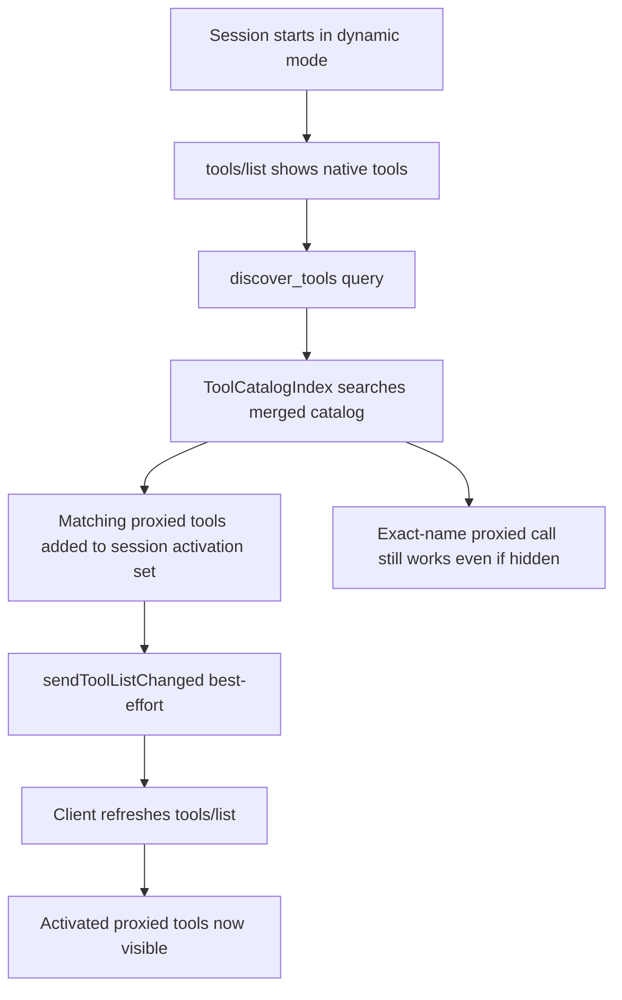

# Tools and Discovery

EVOKORE exposes a combined tool surface of native EVOKORE tools and proxied child-server tools. This page explains how the two populations are presented, how proxy prefixing works, how `discover_tools` shapes the visible tool surface across the two discovery modes, and which environment toggles operators have to tune the default behavior.

## What this covers

- The two tool populations and how prefixing builds proxied tool names
- `legacy` vs `dynamic` discovery and the session-scoped activation lifecycle
- Exact-name compatibility for hidden proxied tools
- Discovery match ranking and the benchmark contract
- Operator tradeoffs and recommendations

## Two tool populations

### Native EVOKORE tools

The native tool surface totals 37 tools split across ten managers. Every one is always visible, never proxy-prefixed, and not subject to discovery-mode hiding.

| Manager | Tools | Count |
|---|---|---|
| `SkillManager` | `docs_architect`, `skill_creator`, `resolve_workflow`, `search_skills`, `get_skill_help`, `discover_tools`, `proxy_server_status`, `refresh_skills`, `fetch_skill`, `list_registry`, `execute_skill`, `describe_tool` | 12 |
| `ClaimsManager` | `claim_acquire`, `claim_release`, `claim_list`, `claim_sweep` | 4 |
| `FleetManager` | `fleet_spawn`, `fleet_claim`, `fleet_release`, `fleet_status` | 4 |
| `SessionAnalyticsManager` | `session_context_health`, `session_analyze_replay`, `session_work_ratio`, `session_trust_report` | 4 |
| `MemoryManager` | `memory_store`, `memory_search`, `memory_list` | 3 |
| `OrchestrationRuntime` | `orchestration_start`, `orchestration_stop`, `orchestration_status` | 3 |
| `WorkerManager` | `worker_context`, `worker_dispatch` | 2 |
| `NavigationAnchorManager` | `nav_get_map`, `nav_read_anchor` | 2 |
| `TelemetryManager` | `get_telemetry`, `reset_telemetry` | 2 |
| `PluginManager` | `reload_plugins` | 1 |

Properties:

- always available
- always visible
- not subject to proxy prefixing
- include `proxy_server_status` for operator-facing inspection of child server health

### Proxied child-server tools

These come from child servers in `mcp.config.json`. The default reference configuration ships:

- `github`
- `fs`
- optional `elevenlabs`
- optional `supabase`

Properties:

- fetched from child servers at startup
- renamed with server prefixes
- governed by `permissions.yml`
- routed through `ProxyManager`

## Prefixing and compatibility

EVOKORE rewrites proxied tool names to:

```text
${serverId}_${tool.name}
```

Why this exists:

- prevents tool-name collisions across child servers
- makes origin obvious during execution and review
- keeps exact-name routing deterministic

Examples:

| Upstream tool | EVOKORE-exposed tool |
|---|---|
| `read_file` from `fs` | `fs_read_file` |
| `create_issue` from `github` | `github_create_issue` |

### Duplicate-prefixed name policy

If two child registrations would create the same final prefixed name:

- the first registration wins
- later duplicates are skipped
- EVOKORE logs a warning and duplicate summary

## Discovery modes

| Mode | What `tools/list` returns | Best for |
|---|---|---|
| `dynamic` | native tools + session-activated proxied tools | smaller initial tool payloads (default) |
| `legacy` | all native + proxied tools | maximum client compatibility |

Environment toggle:

```bash
EVOKORE_TOOL_DISCOVERY_MODE=dynamic   # default
EVOKORE_TOOL_DISCOVERY_MODE=legacy
```

When `EVOKORE_TOOL_DISCOVERY_MODE` is unset the runtime uses `dynamic`. Five named profiles refine the projected proxied surface further; see [`TOOL_DISCOVERY_PROFILES.md`](./TOOL_DISCOVERY_PROFILES.md) for the per-profile token budgets and customization guidance.

## Dynamic discovery lifecycle

In `dynamic` mode, EVOKORE uses a session-scoped activation set.

Current lifecycle notes:

- stdio runtime traffic falls back to one default session key: `__stdio_default_session__`
- session-aware transports (HTTP `Mcp-Session-Id`) can provide real `sessionId` values and get isolated activation sets
- activation state is kept in memory only
- idle activation state is pruned opportunistically, and the in-memory session map stays bounded

Lifecycle:

1. session starts with only native tools visible
2. user/model calls `discover_tools`
3. `ToolCatalogIndex` searches the merged native + proxied catalog
4. matching proxied tools are activated for that session
5. EVOKORE emits `sendToolListChanged()` best-effort
6. client re-runs `tools/list` or auto-refreshes



## Exact-name compatibility

Dynamic mode is intentionally not a hard execution gate.

Important rule:

- **hidden proxied tools remain callable by exact prefixed name**

That means discovery affects **listing visibility**, not whether EVOKORE fundamentally knows how to route the tool.

Why this matters:

- preserves older client flows
- avoids breaking direct exact-name prompts
- makes rollout safer while discovery continues to mature

## How `discover_tools` matches

`ToolCatalogIndex` indexes:

- tool name
- description
- derived keywords
- proxy metadata like `serverId` and `originalName`

Discovery prioritizes:

- exact name matches
- exact original proxied name matches
- keyword matches
- fuzzy matches through `fuse.js`

## Benchmark artifact contract

EVOKORE includes a benchmark harness for the discovery/listing contract:

```bash
npm run benchmark:tool-discovery
```

Default behavior:

- writes deterministic JSON to stdout
- uses stable `generatedAt`
- omits machine-specific timing noise

Optional artifact writing:

```bash
node scripts/benchmark-tool-discovery.js --output artifacts/tool-discovery-benchmark.json
```

Optional live timing telemetry:

```bash
node scripts/benchmark-tool-discovery.js --live-timings
```

### What the benchmark reports

- `toolCounts`
- `payloadBytes`
- `tokens` (real `js-tiktoken` `cl100k_base` counts; replaces the older `estimatedTokens` char/4 estimate)
- `tokenizer` — descriptor with `kind` (`tiktoken` or `approximate`) and `encoding` (`cl100k_base` or fallback string)
- `benchmarkScenario`
- `topMatches`

The benchmark also supports two scoped modes:

- `--profile <name>` — measure a single named profile from `mcp.config.json`
- `--all` — measure every profile (built-in default + everything in config)

In profile mode the output shape is `{ tokenizer, syntheticCatalog, mandatoryInjectionSkills, profiles[] }` — see [`TOOL_DISCOVERY_PROFILES.md`](./TOOL_DISCOVERY_PROFILES.md) for measured budgets.

When `--live-timings` is enabled, it also includes:

- `listLegacy`
- `listDynamic`
- `discover`

### Current contract guarantees

- default stdout is deterministic across repeated runs
- `--output` writes the same JSON that stdout emitted
- `--live-timings` intentionally opts out of deterministic artifact guarantees

## Discovery-mode tradeoffs

| Topic | `legacy` | `dynamic` |
|---|---|---|
| Client compatibility | strongest | good, but depends on discovery-friendly workflow |
| Initial tool payload size | largest | smallest |
| Need to call `discover_tools` | no | usually yes |
| Exact-name direct calls | yes | yes |
| Best fit | broad/default installs | focused sessions and context reduction |

## Operator recommendations

Choose `legacy` when:

- you are onboarding a new client
- you want the most predictable listing behavior
- you do not want to depend on `tools/list_changed`

Choose `dynamic` when:

- tool-list size matters
- your operators know to use `discover_tools`
- your workflows are task-focused and can activate tools intentionally

### Session semantics caveat

For the current stdio runtime, dynamic discovery is effectively connection-scoped through the default session key.

That means:

- one long-lived stdio session accumulates its own discovery activations
- activation isolation becomes meaningfully multi-session only when the transport supplies distinct `sessionId` values

## See also

- [Architecture](./ARCHITECTURE.md) — runtime layers, the catalog index, and request routing
- [Tool Discovery Profiles](./TOOL_DISCOVERY_PROFILES.md) — measured per-profile token budgets
- [Setup](./SETUP.md) — install and configure EVOKORE on a fresh machine
- [Usage](./USAGE.md) — day-to-day invocation patterns
- [Testing and Validation](./TESTING_AND_VALIDATION.md) — the vitest contract and validation surface

Last verified: 2026-05-20
