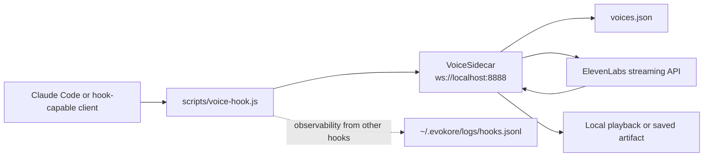

# Voice and Hooks

EVOKORE currently has three separate voice-related systems plus a set of hook and observability utilities. They overlap in operator workflows, but they are not the same runtime.

## What this covers

- The three voice-related systems (ElevenLabs MCP proxy, VoiceMode, VoiceSidecar)
- The voice + hook pipeline and protocol
- `voices.json` and persona hot-reload
- Playback disable and artifact capture
- The hook inventory plus observability and continuity logs
- Replay and TillDone operator workflows
- Targeted validation commands
- Choosing a voice path for your scenario

## The three voice-related systems

### 1. ElevenLabs MCP proxy

This is the optional `elevenlabs` child server configured in `mcp.config.json`.

What it is:

- proxied through the EVOKORE router
- exposed as prefixed MCP tools
- available to any EVOKORE-connected MCP client when configured successfully

What it is for:

- text-to-speech and other ElevenLabs MCP operations as tools
- routing voice-related actions through the standard EVOKORE proxy/security stack

Requirements:

- `uvx` available on PATH
- `ELEVENLABS_API_KEY` set

### 2. VoiceMode

VoiceMode is a separate voice-conversation system for Claude Code.

What it is:

- registered separately from EVOKORE
- not routed through EVOKORE’s stdio server
- used for bidirectional voice conversation in Claude Code

What it is for:

- speaking to Claude and hearing spoken responses
- using `OPENAI_API_KEY` and VoiceMode’s own runtime

Windows note:

- VoiceMode relies on `uvx` being directly available
- set `OPENAI_API_KEY` in the shell that launches Claude Code

### 3. VoiceSidecar

VoiceSidecar is a standalone WebSocket server implemented in `src/VoiceSidecar.ts`.

What it is:

- independent from the EVOKORE stdio router
- listens on `ws://localhost:8888` by default
- commonly used with `scripts/voice-hook.js`

What it is for:

- auto-speaking model responses
- custom WebSocket voice producers
- local playback and/or artifact capture

Runtime features:

- hot-reloads `voices.json` on each new connection
- supports `VOICE_SIDECAR_DISABLE_PLAYBACK=1`
- supports `VOICE_SIDECAR_ARTIFACT_DIR=/absolute/path`

## Voice + hook pipeline



## VoiceSidecar protocol

Each WebSocket message is JSON:

| Field | Type | Meaning |
|---|---|---|
| `text` | `string` | text chunk to append |
| `persona` | `string` | optional persona key from `voices.json` |
| `flush` | `boolean` | finalize buffered text and trigger synthesis |

Examples:

```json
{"text":"Hello world.","persona":"orchestrator","flush":true}
```

Chunked:

```json
{"text":"First part. ","persona":"orchestrator"}
{"text":"Second part."}
{"text":"","flush":true}
```

Behavior notes:

- unknown personas fall back to `default`
- `flush: true` can arrive with or without additional text
- the sidecar resolves persona config per connection
- the bundled `scripts/voice-hook.js` can forward persona via `VOICE_SIDECAR_PERSONA`, payload `persona`, or payload `metadata.persona`

## `voices.json` and persona hot-reload

`voices.json` contains:

- `default` voice configuration
- `personas` overrides such as `orchestrator`, `researcher`, `architect`, `implementer`, `tester`, `reviewer`

Current hot-reload contract:

- VoiceSidecar re-reads `voices.json` on every new WebSocket connection
- you do not need to restart the sidecar for persona edits to apply to new connections

## Playback disable and artifact capture

### Disable playback

```bash
VOICE_SIDECAR_DISABLE_PLAYBACK=1
```

Use this for:

- quiet local validation
- CI-like checks
- artifact-only runs

### Save final playable audio

```bash
VOICE_SIDECAR_ARTIFACT_DIR=artifacts/voice-sidecar
```

Use this for:

- keeping `.mp3` outputs
- validating end-to-end voice generation
- attaching artifacts to manual debugging

## Hook inventory

| Script | Purpose | State/log location |
|---|---|---|
| `scripts/voice-hook.js` | forwards response text to VoiceSidecar | no durable state by itself |
| `scripts/hooks/damage-control.js` | canonical tool-use guardrail hook entrypoint | observability in `~/.evokore/logs/hooks.jsonl` |
| `scripts/hooks/purpose-gate.js` | canonical purpose capture/reminder hook entrypoint | observability in `~/.evokore/logs/hooks.jsonl` |
| `scripts/hooks/session-replay.js` | canonical append-only replay log entrypoint | `~/.evokore/sessions/*-replay.jsonl` |
| `scripts/hooks/evidence-capture.js` | canonical evidence capture hook entrypoint | `~/.evokore/sessions/*-evidence.jsonl` |
| `scripts/hooks/tilldone.js` | canonical session task hook entrypoint | `~/.evokore/sessions/*-tasks.json` |
| `scripts/hooks/fail-safe-loader.js` | shared bootstrap guard for active hook entrypoints | bootstrap fail-safe events in `~/.evokore/logs/hooks.jsonl` |
| `scripts/damage-control.js` | legacy-compatible damage-control entrypoint | delegates to the same runtime behavior |
| `scripts/purpose-gate.js` | legacy-compatible purpose-gate entrypoint | delegates to the same runtime behavior |
| `scripts/session-replay.js` | legacy-compatible replay entrypoint | delegates to the same runtime behavior |
| `scripts/tilldone.js` | legacy-compatible TillDone CLI/hook entrypoint | delegates to the same runtime behavior |
| `scripts/status.js` | terminal status line helper backed by continuity + memory state | reads `~/.evokore/sessions/*.json`, git state, and Claude memory fallback |
| `scripts/hook-log-view.js` | viewer for hook observability logs | reads `~/.evokore/logs/hooks.jsonl` |
| `scripts/session-replay-view.js` | viewer for replay logs | reads `~/.evokore/sessions/*-replay.jsonl` |

## Hook observability

Hook observability writes best-effort JSONL telemetry to:

```text
~/.evokore/logs/hooks.jsonl
```

Key properties:

- append-only event stream
- sanitized `session_id` when present
- fail-safe: logging failure should not block the hook path
- automatic log rotation at 5 MB
- up to 3 rotated files retained

Common fields:

- `ts`
- `hook`
- `event`
- `session_id`
- hook-specific metadata

## Session continuity manifest

The canonical runtime continuity record now lives at:

```text
~/.evokore/sessions/<session>.json
```

This manifest is updated by `purpose-gate`, `session-replay`, `evidence-capture`, and `tilldone`. It ties the session together by recording:

- purpose and purpose timestamps
- lifecycle timestamps such as `createdAt`, `updatedAt`, and `lastActivityAt`
- latest tool/evidence/task metadata
- artifact paths for replay, evidence, and task files
- derived counters for replay entries, evidence entries, and incomplete tasks

`scripts/status.js` now uses this manifest as its primary runtime source. If the current repo has no live manifest, it falls back to the managed Claude memory snapshot from `project-state.md`.

## Replay and TillDone workflows

### Session replay

Capture tool summaries for later review:

```bash
node scripts/session-replay-view.js --latest
```

Shortcut:

```bash
npm run replay
```

Stored files:

```text
~/.evokore/sessions/<session>.json
~/.evokore/sessions/<session>-replay.jsonl
```

### TillDone

Track tasks during a session:

```bash
node scripts/tilldone.js --add "Update docs portal" --session auto
node scripts/tilldone.js --list --session auto
node scripts/tilldone.js --done 1 --session auto
```

Hook mode behavior:

- blocks session stop when incomplete tasks remain
- emits hook observability events
- can be cleared manually if needed

Stored files:

```text
~/.evokore/sessions/<session>.json
~/.evokore/sessions/<session>-tasks.json
```

## Targeted validation commands

```bash
node test-voice-e2e-validation.js
node test-voice-refinement-validation.js
node test-voice-sidecar-smoke-validation.js
node test-voice-sidecar-hotreload-validation.js
node test-voice-contract-validation.js
node test-voice-windows-docs-validation.js
node hook-test-suite.js
node hook-e2e-validation.js
```

Optional live provider validation:

```bash
EVOKORE_RUN_LIVE_VOICE_TEST=1 ELEVENLABS_API_KEY=your_key_here npm run test:voice:live
```

## Which voice path should you use?

| Need | Use |
|---|---|
| MCP tools for TTS and related operations | optional proxied `elevenlabs` child server |
| direct voice conversation in Claude Code | VoiceMode |
| auto-speak hook-driven responses or custom WebSocket producers | VoiceSidecar |

## See also

- [Setup](./SETUP.md) - install, env vars, client registration
- [Usage](./USAGE.md) - day-to-day operator flows
- [Voice Sidecar Guide](./guides/VOICE_SIDECAR_GUIDE.md) - end-to-end sidecar walkthrough
- [Troubleshooting](./TROUBLESHOOTING.md) - when a voice or hook path misbehaves
- [Testing and Validation](./TESTING_AND_VALIDATION.md) - voice and hook test surface

Last verified: 2026-05-20
